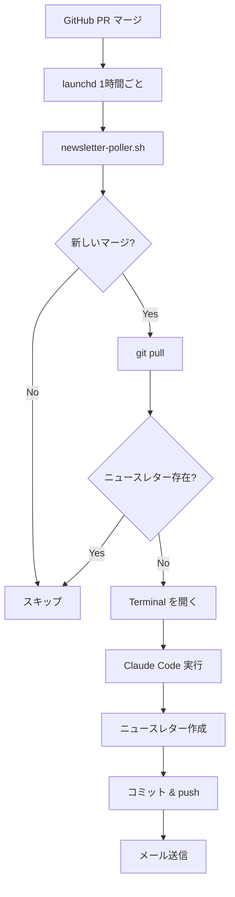

# ニュースレター自動化

PRマージ後にニュースレターを自動作成・送信する仕組み。

## フロー



## ファイル構成

| ファイル | 役割 |
|---------|------|
| `scripts/newsletter-poller.sh` | GitHub をポーリングしてマージを検出 |
| `scripts/create-newsletter.sh` | 手動実行用ワンタッチスクリプト |
| `.claude/commands/create-newsletter-auto.md` | Claude Code 非対話版コマンド |
| `~/Library/LaunchAgents/<label>.plist` | launchd 設定 |

## 手動実行

```bash
newsletter           # 最新の記事からニュースレター作成
newsletter 2026-01-20  # 日付指定
```

## launchd 管理

```bash
# 状態確認
launchctl list | grep newsletter

# 停止
launchctl unload ~/Library/LaunchAgents/<label>.plist

# 再起動
launchctl unload ~/Library/LaunchAgents/<label>.plist
launchctl load ~/Library/LaunchAgents/<label>.plist
```

## ログ

```bash
tail -f ~/Library/Logs/newsletter-poller.log
```

## 依存関係

- gh CLI
- Claude Code
- Terminal.app
- launchd
